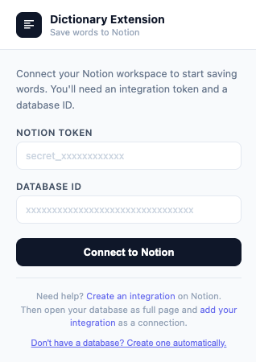
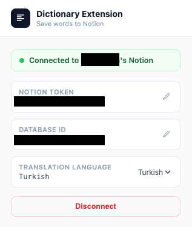
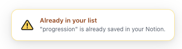

# NotionDictionary

A Chrome extension that turns any word you select on any webpage into a structured Notion vocabulary entry — in one click.

---

## Problem

Since language learning is a non-stop process, every unfamiliar word I come across while reading feels like a small opportunity. My usual workaround completely broke my focus: copying the word, opening Cambridge Dictionary, looking it up, pasting it somewhere. This extension collapses all of that into a single click.

---

## Solution

NotionDictionary adds a small floating toolbar whenever you highlight a word. One button saves it directly to your Notion database with its full dictionary data. Another opens it in Cambridge Dictionary if you want to read more. No tab switching, no copy-pasting.

---

## How It Works

1. You select a word anywhere on any webpage.
2. A small toolbar appears just above the selection with two buttons.
3. Clicking **Save to Notion**:
   - Checks if the word already exists in your database (skips if it does).
   - Fetches the definition, pronunciation audio URL, part of speech, usage examples, synonyms, and antonyms from the [Free Dictionary API](https://dictionaryapi.dev).
   - Fetches a translation into your chosen language via the [MyMemory API](https://mymemory.translated.net).
   - Creates a new page in your Notion database with all of the above fields.
   - Shows a toast notification at the bottom-right corner of the page.
4. Clicking **Cambridge** opens `dictionary.cambridge.org` for that word in a new tab.

### Notion database schema

| Property | Type | Content |
|---|---|---|
| `word` | Title | The selected word |
| `translation` | Text | Translation in your chosen language |
| `pronounce` | Text | Audio URL from the dictionary |
| `part_of_speech` | Text | noun, verb, adjective… |
| `examples` | Text | Definitions with numbered examples |
| `synonyms` | Text | Comma-separated synonyms |
| `antonyms` | Text | Comma-separated antonyms |

---

## Setup

### 1. Install the extension

1. Clone or download this repository.
2. Open Chrome and go to `chrome://extensions`.
3. Enable **Developer mode** (top-right toggle).
4. Click **Load unpacked** and select the project folder.

> **Note:** The `screenshots/` folder is only used for this README and has no effect on the extension. You can safely delete it.

### 2. Create a Notion integration

1. Go to [notion.so/my-integrations](https://www.notion.so/my-integrations).
2. Click **New integration**, give it a name, and save.
3. Copy the **Internal Integration Token** — it starts with `secret_`.

### 3. Connection screen

Click the extension icon in your browser toolbar. You will see the setup screen asking for two things:

- **Notion Token** — paste your `secret_xxxx` token here.
- **Database ID** — the 32-character ID from your Notion database URL.

> To find your Database ID: open the database as a full page in Notion. The URL will look like `notion.so/your-workspace/xxxxxxxxxxxxxxxxxxxxxxxxxxxxxxxx?v=...` — the long hex string is the ID.

After filling both fields, click **Connect to Notion**.

---

## Don't have a database yet?

The extension can create one for you automatically.

Click **"Don't have a database? Create one automatically."** below the connection form. A new section will appear:

1. Open the Notion page where you want the database to live.
2. Click `···` → **Connections** → add your integration to that page.
3. Copy the page URL or its ID and paste it into the **Parent Page** field.
4. Click **Create Database**.

The extension will create a database called **"My Dictionary"** with all the required columns and fill in the Database ID field for you.

---

## After connecting

Once your credentials are saved you will see the connected view instead of the setup form.

From here you can:

- **See the connection status** — a green dot confirms Notion is reachable.
- **Edit your token or database ID** individually using the pencil icons.
- **Choose a translation language** — select from Turkish, Spanish, French, German, and more. Every word you save will include a translation into that language. Set to *No translation* to skip it.
- **Disconnect** — clears all saved credentials and returns to the setup screen.

### Toast notifications

| State | Meaning |
|---|---|
| ✅ Green — *Saved to Notion* | Word was added successfully. |
| ⚠️ Yellow — *Already in your list* | The word already exists in the database. |
| ❌ Red — *Something went wrong* | Credential error, word not found, or API issue. |

---

## APIs Used

| API | Purpose | Docs |
|---|---|---|
| [Free Dictionary API](https://dictionaryapi.dev) | Definitions, examples, synonyms, antonyms | free, no key required |
| [MyMemory](https://mymemory.translated.net) | Translation | free tier, no key required |
| [Notion API](https://developers.notion.com) | Read/write database | requires integration token |

---

## Privacy

This extension stores only your Notion token, database ID, and translation language preference in Chrome's `sync` storage. No data is sent to any server other than the three APIs listed above. See [PRIVACY.md](PRIVACY.md) for the full policy.
